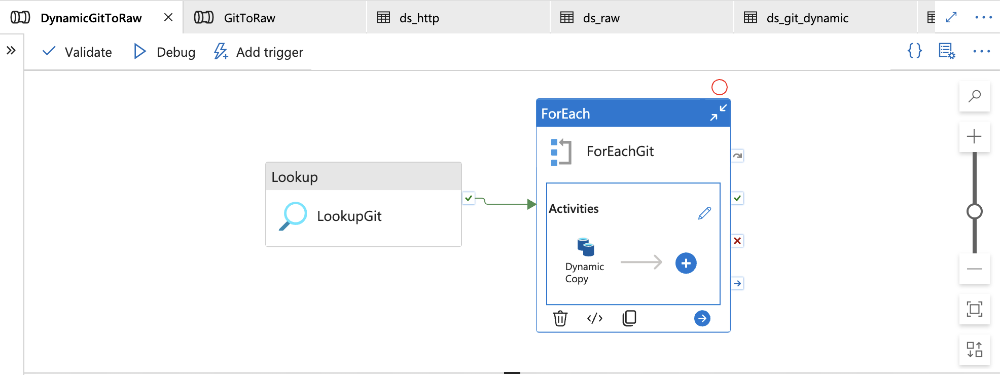
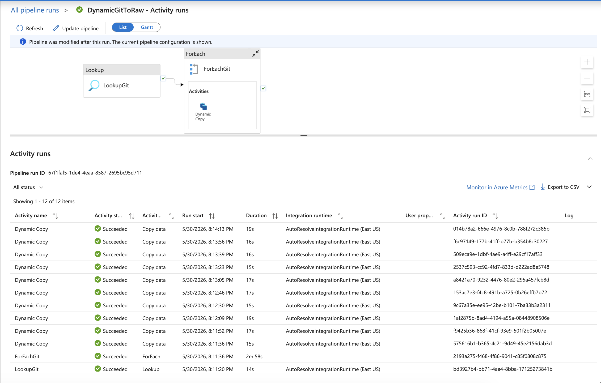

# Azure Data Factory (ADF)
## Description

This pipeline automates the ingestion of data from external APIs into Azure Data Lake Storage Gen2 using Azure Data Factory. The raw data is stored in the Bronze layer, from where Azure Databricks performs data cleansing, transformation, and enrichment before promoting the data to downstream layers for analytics and reporting.

## Workflow
1. A Lookup activity reads a JSON configuration file containing metadata for each source file, including:
- **Relative URL** – Specifies the API endpoint path used to retrieve data.
- **Destination Folder Name** – Defines the target folder in the Bronze layer of ADLS Gen2.
- **File Name** – Specifies the output file name for the ingested dataset.
2. The Lookup output is passed to a ForEach activity, which iterates through the metadata records using the value array returned by the Lookup activity.
3. A parameterized Copy Data activity is executed within the ForEach loop. For each iteration:
4. The source file is dynamically retrieved from the GitHub repository using the relative URL.
5. The destination path is dynamically generated using the folder name and file name from the metadata.
6. The ingested files are loaded into the Bronze layer of Azure Data Lake Storage Gen2, preserving the raw source data for downstream processing.

## Pipeline Architecture

## Pipeline Run Status

## Key Features

- Metadata-driven architecture using a JSON configuration file
- Dynamic parameterization of source and destination paths
- Automated ingestion of multiple CSV files using a single pipeline
- Scalable design that supports onboarding new files through configuration updates
- Raw data storage in the Bronze layer of Azure Data Lake Storage Gen2
- Configuration-based processing using Lookup and ForEach activities
- Reusable and maintainable pipeline design with minimal code changes

## Technologies Used

- Azure Data Factory (ADF)
- Azure Data Lake Storage Gen2 (ADLS Gen2)
- GitHub
- JSON
- CSV

## Pipeline Components

| Component | Purpose |
|------------|---------|
| Lookup Activity | Reads metadata from the JSON configuration file |
| ForEach Activity | Iterates through each metadata record |
| Copy Data Activity | Dynamically copies source files from GitHub to ADLS Gen2 |
| Source Dataset | Parameterized dataset pointing to GitHub-hosted CSV files |
| Sink Dataset | Parameterized dataset writing data to the Bronze layer |
