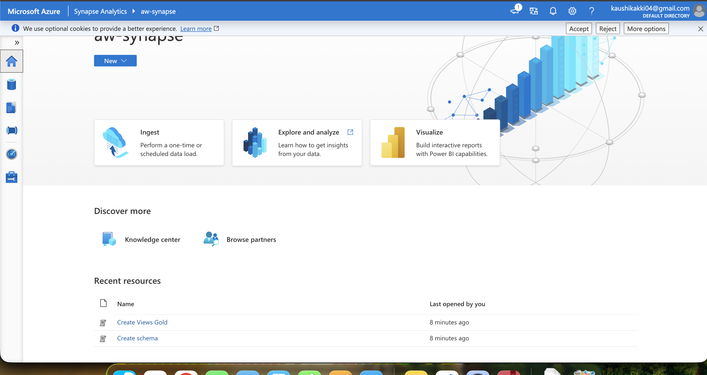
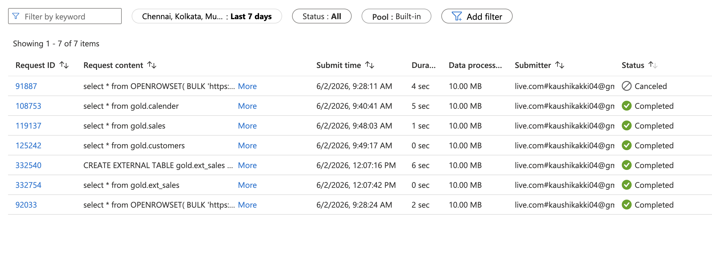
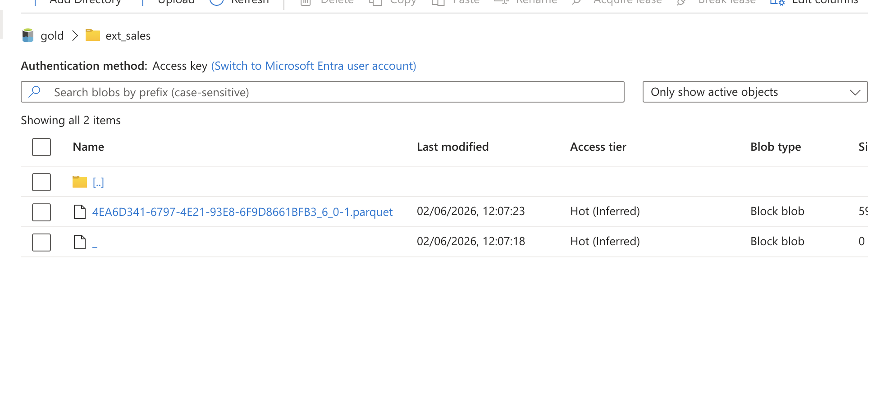

# Azure Synapse Analytics - Silver to Gold Layer

## Overview

This phase of the project focuses on building the Gold layer using Azure Synapse Analytics. Processed data stored in the Silver layer of Azure Data Lake Storage Gen2 (ADLS Gen2) is queried using Serverless SQL Pools, transformed into analytical structures, and exposed through external tables for reporting and downstream consumption.

---

## Workflow

1. Created an Azure Synapse Analytics workspace.

2. Configured Managed Identity-based access between Azure Synapse Analytics and Azure Data Lake Storage Gen2.

3. Created a Serverless SQL Database for querying data directly from the data lake.

4. Queried Parquet files stored in the Silver layer using the `OPENROWSET()` function.

5. Created a dedicated Gold schema to organize curated analytical datasets.

6. Developed SQL Views for each dataset to provide a logical abstraction layer over Silver layer data.

7. Configured external table infrastructure by creating:

   * Database Scoped Credential
   * External Data Source
   * External File Format

8. Implemented CETAS (Create External Table As Select) to materialize curated datasets as external tables.

9. Stored the Gold layer datasets in ADLS Gen2 and exposed them through external tables for analytics and reporting.

---

## Key Features

* Serverless analytics using Azure Synapse SQL
* Direct querying of Parquet files using OPENROWSET()
* Managed Identity-based authentication
* Gold layer implementation using SQL Views and External Tables
* Data virtualization using External Data Sources
* CETAS-based creation of analytical datasets
* Separation of Silver and Gold data layers

---

## Technologies Used

* Azure Synapse Analytics
* Serverless SQL Pool
* Azure Data Lake Storage Gen2 (ADLS Gen2)
* T-SQL
* OPENROWSET
* CETAS (Create External Table As Select)
* Managed Identity
* Parquet

---

## Screenshots

### Synapse Workspace



### Query Execution Status



### Gold Layer External Tables



---

## Repository Structure

```text
Azure Synapse/
│
├── SQL Queries/
│
├── Screenshots/
│   ├── GOLD_layer_file.png
│   ├── Queries_status.png
│   └── Synapse_workspace.png
│
└── README.md
```

---

## Outcome

Successfully implemented a Gold layer analytics architecture using Azure Synapse Analytics. Silver layer Parquet files were queried using Serverless SQL Pools, transformed into curated datasets through Views and CETAS, and exposed through external tables for downstream analytics and reporting.

This implementation follows the Medallion Architecture pattern, where transformed Silver layer data is promoted from the Silver layer to the Gold layer to support business intelligence and analytical workloads.

