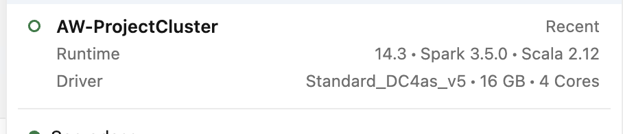
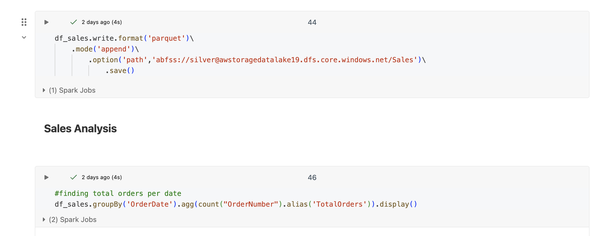
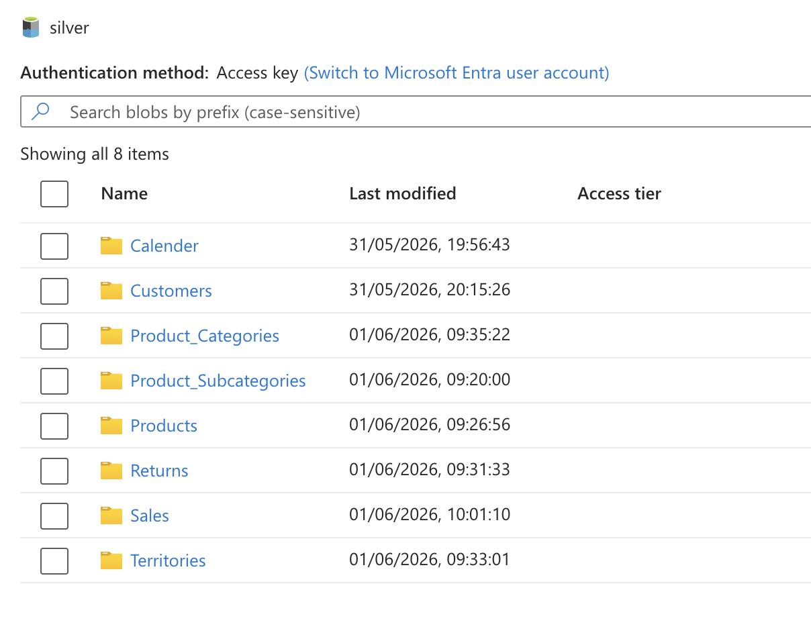

# Azure Databricks - Bronze to Silver Transformation

## Overview

This phase of the project focuses on transforming raw data stored in the Bronze layer of Azure Data Lake Storage Gen2 (ADLS Gen2) using Azure Databricks and PySpark.

The solution securely connects Azure Databricks to ADLS Gen2 using Microsoft Entra ID and a Service Principal. Raw CSV files are read from the Bronze layer, transformed using PySpark, and written to the Silver layer in Parquet format for downstream analytics and reporting.

---

## Workflow

1. Created an Azure Databricks workspace within the Azure resource group.

2. Provisioned a Databricks cluster to perform distributed data processing.

3. Configured secure authentication between Azure Databricks and ADLS Gen2 using:

   * Microsoft Entra ID
   * Service Principal
   * Secret-based authentication
   * IAM role assignment (Storage Blob Data Contributor)

4. Established connectivity between Databricks and the Bronze layer of ADLS Gen2.

5. Read raw CSV files from the Bronze layer into PySpark DataFrames.

6. Performed data transformations including:

   * Adding columns
   * Replacing existing values with standardized values
   * Arithmetic calculations and transformations
   * Column aliasing and renaming

7. Wrote the transformed data to the Silver layer in Parquet format for optimized storage and analytics.

---

## Key Features

* Secure ADLS Gen2 access using Microsoft Entra ID and Service Principal authentication
* Distributed data processing using Azure Databricks clusters
* PySpark-based data transformation and enrichment
* Bronze-to-Silver data processing architecture
* Parquet-based optimized storage format
* Reusable notebook-driven transformation workflow

---

## Technologies Used

* Azure Databricks
* Apache Spark
* PySpark
* Azure Data Lake Storage Gen2 (ADLS Gen2)
* Microsoft Entra ID
* Service Principal
* Azure IAM
* Parquet
* Python

---

## Screenshots

### Databricks Cluster



### Notebook Execution



### Silver Layer Output



---

## Repository Structure

```text
Databricks/
│
├── Notebooks/
│   └── Bronze_to_Silver_Transformation.py
│
├── Screenshots/
│   ├── AD_NB.png
│   ├── Cluster.png
│   └── Silver_layer_files.png
│
└── README.md
```

## Outcome

Successfully implemented a secure and scalable Bronze-to-Silver data processing pipeline using Azure Databricks and ADLS Gen2. Raw CSV data was transformed using PySpark and stored in Parquet format, improving storage efficiency and preparing the dataset for downstream analytics and reporting.

