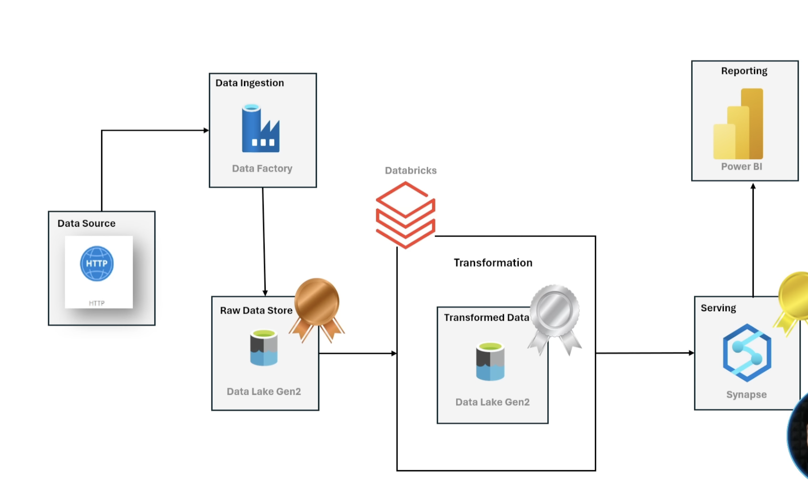
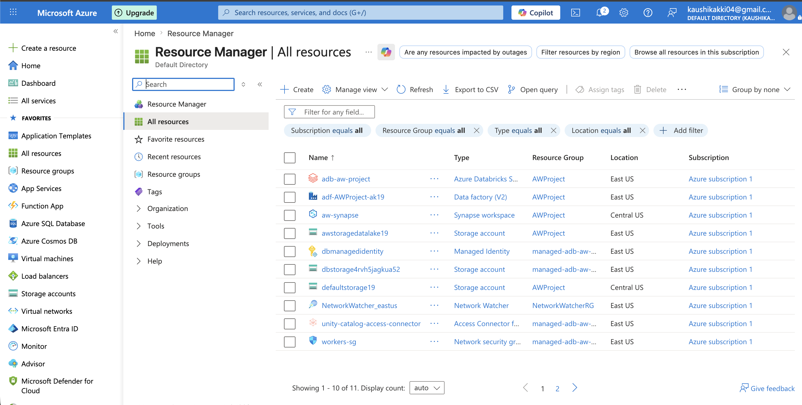

# Azure End-to-End Data Engineering Project - Adventure Works

## Overview

This project demonstrates the implementation of an end-to-end Azure Data Engineering solution using Azure Data Factory, Azure Databricks, Azure Synapse Analytics, and Azure Data Lake Storage Gen2.

The solution follows the Medallion Architecture (Bronze, Silver, and Gold layers) to ingest, transform, and serve data for analytics and reporting. Data is ingested from source files, transformed using PySpark in Databricks, and exposed through Synapse Analytics for downstream consumption.

---

## Solution Architecture



---

## Azure Resources

The following Azure resources were provisioned and configured to implement the end-to-end data engineering solution.



---

## Architecture Components

### Data Source

* Source datasets stored as CSV files.
* Metadata maintained in JSON format.

### Azure Data Factory (Bronze Layer)

* Metadata-driven ingestion framework.
* Lookup activity reads configuration metadata.
* ForEach activity dynamically processes source files.
* Copy activity ingests files into Azure Data Lake Storage Gen2.
* Raw data stored in the Bronze layer.

### Azure Databricks (Silver Layer)

* Secure connectivity established using Microsoft Entra ID and Service Principal authentication.
* PySpark notebooks process raw Bronze layer data.
* Data cleansing, enrichment, and transformation performed.
* Output stored in Parquet format within the Silver layer.

### Azure Synapse Analytics (Gold Layer)

* Serverless SQL Pool used for analytics.
* Silver layer data queried using OPENROWSET().
* Gold schema created for curated datasets.
* Views and External Tables implemented using CETAS.
* Gold layer exposed for analytical workloads and reporting.

---

## End-to-End Workflow

### Phase 1 - Data Ingestion

1. Azure Data Factory reads metadata from a JSON configuration file.
2. Metadata contains:

   * Relative URL
   * Folder Name
   * File Name
3. Lookup activity retrieves metadata.
4. ForEach activity iterates through all records.
5. Copy Data activity dynamically ingests source files.
6. Raw data is stored in the Bronze layer of ADLS Gen2.

### Phase 2 - Data Transformation

1. Azure Databricks connects to ADLS Gen2 using Service Principal authentication.
2. Bronze layer CSV files are loaded into PySpark DataFrames.
3. Data transformations are performed:

   * Derived column creation
   * Value replacement and standardization
   * Arithmetic calculations
   * Column aliasing and renaming
4. Transformed datasets are written to the Silver layer in Parquet format.

### Phase 3 - Analytics & Serving

1. Azure Synapse Analytics accesses Silver layer data through Managed Identity.
2. OPENROWSET() is used to query Parquet files.
3. Gold schema is created.
4. SQL Views are developed for curated datasets.
5. External objects are configured:

   * Database Scoped Credential
   * External Data Source
   * External File Format
6. CETAS is used to create Gold layer External Tables.
7. Curated datasets are exposed for analytics and reporting.

---

## Technologies Used

### Azure Services

* Azure Data Factory (ADF)
* Azure Databricks
* Azure Synapse Analytics
* Azure Data Lake Storage Gen2 (ADLS Gen2)
* Microsoft Entra ID
* Managed Identity

### Programming & Query Languages

* PySpark
* Python
* T-SQL
* SQL

### File Formats

* CSV
* JSON
* Parquet

---

## Medallion Architecture

### Bronze Layer

* Raw source data
* Ingested using Azure Data Factory
* Stored in ADLS Gen2

### Silver Layer

* Cleaned and transformed datasets
* Processed using Azure Databricks
* Stored in Parquet format

### Gold Layer

* Curated analytical datasets
* Built using Azure Synapse Analytics
* Exposed through Views and External Tables

---

## Key Features

* Metadata-driven ingestion architecture
* Dynamic parameterization in Azure Data Factory
* End-to-end Medallion Architecture implementation
* Secure authentication using Microsoft Entra ID and Managed Identity
* Distributed data processing using Azure Databricks
* Bronze-to-Silver transformation pipeline
* Silver-to-Gold analytics pipeline
* Serverless analytics using Azure Synapse SQL
* External Tables created using CETAS
* Scalable and reusable data engineering design

---

## Repository Structure

```text
Azure-End-to-End-Data-Engineering-Project
│
├── ADF/
│   ├── ARM Templates
│   ├── Screenshots
│   └── README.md
│
├── Databricks/
│   ├── Notebooks
│   ├── Screenshots
│   └── README.md
│
├── Azure Synapse/
│   ├── SQL Queries
│   ├── Screenshots
│   └── README.md
│
├── Architecture/
│   ├── Architecture.png
│   ├── Azure_Workspace.png
│   └── README.md
│
└── README.md
```

---

## Security Implementation

* Microsoft Entra ID Authentication
* Service Principal Authentication
* Managed Identity Integration
* Azure RBAC (Role-Based Access Control)
* Storage Blob Data Contributor Permissions
* Secret-Based Credential Management

---

## Business Outcome

The solution automates the complete data lifecycle from ingestion to analytics. Raw source data is transformed into curated Gold layer datasets that can be consumed by business intelligence and reporting tools, enabling scalable and efficient data-driven decision making.

---

## Future Enhancements

* Incremental Data Loading
* Delta Lake Implementation
* ADF Trigger-Based Scheduling
* Monitoring and Alerting
* CI/CD using Azure DevOps
* Data Quality Validation Framework
* Power BI Dashboard Integration
